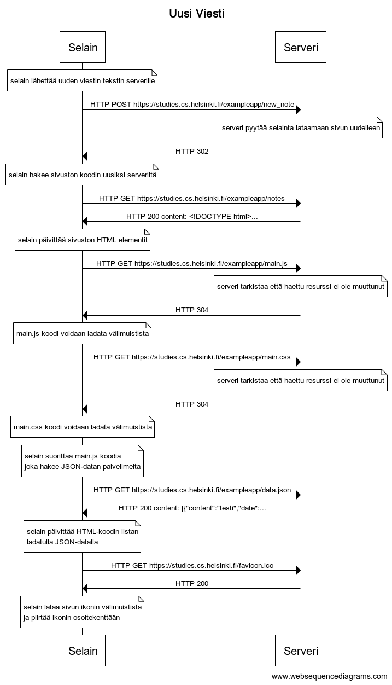

# Uusi viesti

### Sekvenssikaavio



### WebSequenceDiagrams palvelun koodi

```
title Uusi Viesti

note over Selain: selain lähettää uuden viestin tekstin serverille
Selain->Serveri: HTTP POST https://studies.cs.helsinki.fi/exampleapp/new_note
note over Serveri: serveri pyytää selainta lataamaan sivun uudelleen
Serveri->Selain: HTTP 302

note over Selain: selain hakee sivuston koodin uusiksi serveriltä
Selain->Serveri: HTTP GET https://studies.cs.helsinki.fi/exampleapp/notes
Serveri->Selain: HTTP 200 content: <!DOCTYPE html>...

note over Selain: selain päivittää sivuston HTML elementit
Selain->Serveri: HTTP GET https://studies.cs.helsinki.fi/exampleapp/main.js
note over Serveri: serveri tarkistaa että haettu resurssi ei ole muuttunut
Serveri->Selain: HTTP 304
note over Selain: main.js koodi voidaan ladata välimuistista

Selain->Serveri: HTTP GET https://studies.cs.helsinki.fi/exampleapp/main.css
note over Serveri: serveri tarkistaa että haettu resurssi ei ole muuttunut
Serveri->Selain: HTTP 304
note over Selain: main.css koodi voidaan ladata välimuistista

note over Selain:
selain suorittaa main.js koodia
joka hakee JSON-datan palvelimelta
end note

Selain->Serveri: HTTP GET https://studies.cs.helsinki.fi/exampleapp/data.json
Serveri->Selain: HTTP 200 content: [{"content":"testi","date":...

note over Selain:
selain päivittää HTML-koodin listan
ladatulla JSON-datalla
end note

Selain->Serveri: HTTP GET https://studies.cs.helsinki.fi/favicon.ico
Serveri->Selain: HTTP 200

note over Selain:
selain lataa sivun ikonin välimuistista
ja piirtää ikonin osoitekenttään
end note
```