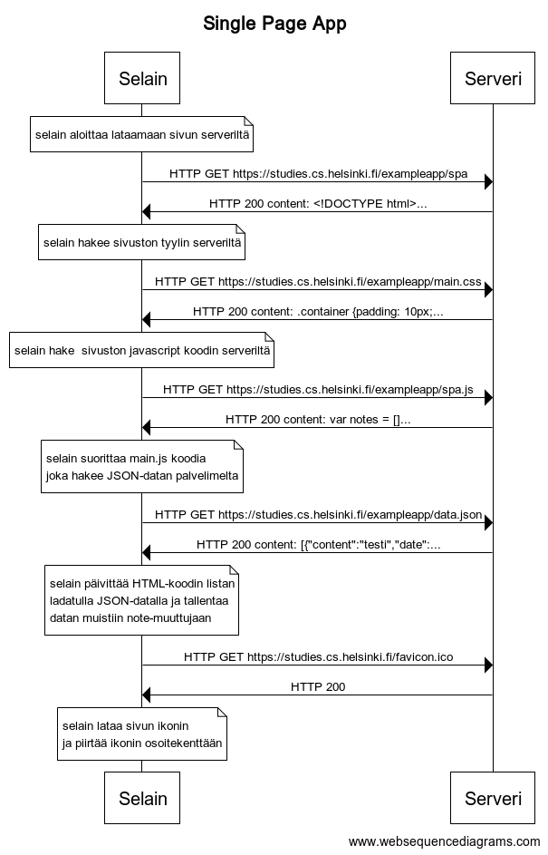

# Uusi muistiinpano

### Sekvenssikaavio



### WebSequenceDiagrams palvelun koodi

```
title Single Page App

note over Selain: selain aloittaa lataamaan sivun serveriltä
Selain->Serveri: HTTP GET https://studies.cs.helsinki.fi/exampleapp/spa
Serveri->Selain: HTTP 200 content: <!DOCTYPE html>...

note over Selain: selain hakee sivuston tyylin serveriltä
Selain->Serveri: HTTP GET https://studies.cs.helsinki.fi/exampleapp/main.css
Serveri->Selain: HTTP 200 content: .container {padding: 10px;...

note over Selain: selain hake  sivuston javascript koodin serveriltä
Selain->Serveri: HTTP GET https://studies.cs.helsinki.fi/exampleapp/spa.js
Serveri->Selain: HTTP 200 content: var notes = []...

note over Selain:
selain suorittaa main.js koodia
joka hakee JSON-datan palvelimelta
end note
Selain->Serveri: HTTP GET https://studies.cs.helsinki.fi/exampleapp/data.json
Serveri->Selain: HTTP 200 content: [{"content":"testi","date":...
note over Selain:
selain päivittää HTML-koodin listan
ladatulla JSON-datalla ja tallentaa
datan muistiin note-muuttujaan
end note

Selain->Serveri: HTTP GET https://studies.cs.helsinki.fi/favicon.ico
Serveri->Selain: HTTP 200
note over Selain:
selain lataa sivun ikonin
ja piirtää ikonin osoitekenttään
end note
```