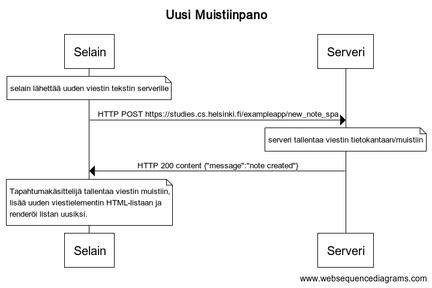

# Uusi muistiinpano

### Sekvenssikaavio



### WebSequenceDiagrams palvelun koodi

```
title Uusi Muistiinpano

note over Selain: selain lähettää uuden viestin tekstin serverille
Selain->Serveri: HTTP POST https://studies.cs.helsinki.fi/exampleapp/new_note_spa
note over Serveri: serveri tallentaa viestin tietokantaan/muistiin
Serveri->Selain: HTTP 200 content {"message":"note created"}

note over Selain:
Tapahtumakäsittelijä tallentaa viestin muistiin,
lisää uuden viestielementin HTML-listaan ja
renderöi listan uusiksi.
end note
```